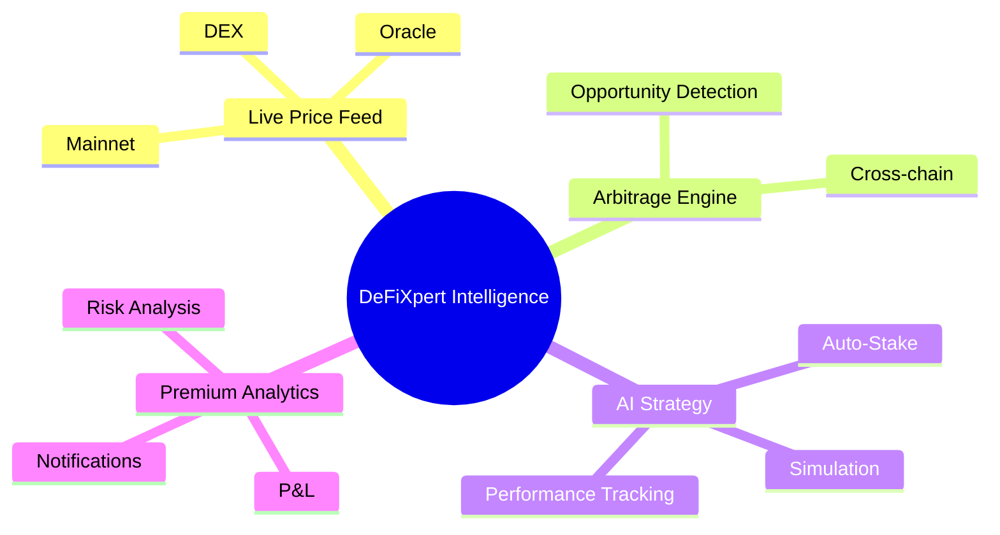

# 🚀 Live DeFi Opportunities & AI Strategy Platform

> **A cutting-edge platform for real-time DeFi analytics, AI-driven strategies, and cross-chain arbitrage—empowering users to unlock the full potential of decentralized finance.**


---

## Overview

Welcome to the next-generation DeFi platform for:

- **Live price feeds** from mainnet (DEX & oracle integrations)
- **Real-time arbitrage and trading opportunities**
- **AI-powered strategy management and simulation**
- **Premium analytics and performance tracking**


All modules are cross-chain compatible and designed for high-frequency data streaming. The backend leverages JuliaOS for robust, scalable, and modular agent-based architecture.

---

## 🧠 Intelligence Diagram



---

## 🔥 Main Features

|  |  |  |  |  |
|:---:|:---:|:---:|:---:|:---:|

| Module                | Description                                                                 | Status         |
|-----------------------|-----------------------------------------------------------------------------|---------------|
| Live Price Feed       | Fetches and streams prices from mainnet DEXs and oracles                    | ✅ Active      |
| Arbitrage Detection   | Detects and records real-time arbitrage opportunities across chains         | ✅ Active      |
| AI Strategy Engine    | Simulates and manages strategies using AI models                            | ⚠️ In Dev      |
| Auto-Stake/Unstake    | AI-powered automatic staking and unstaking                                  | ⚠️ In Dev      |
| Premium Analytics     | Detailed P&L, win rate, and risk analysis for premium users                 | ✅ Active      |
| Performance Tracking  | Tracks strategy performance and generates reports                           | ✅ Active      |

---

## 🏗️ Architecture

- **Backend:** JuliaOS-based, modular, agent-driven. Handles price feeds, opportunity detection, and strategy simulation.
- **Frontend:** React-based dashboard for live monitoring, analytics, and user interaction.
- **Database:** Optimized for real-time opportunity and performance data.

---


## ⚡ Quick Start

### 1. PostgreSQL Database Setup

This project requires a running **PostgreSQL** database for storing live price feeds, arbitrage opportunities, strategy performance, and analytics.

#### Install PostgreSQL

- **Windows:** Download and install from [postgresql.org/download/windows](https://www.postgresql.org/download/windows/)
- **macOS:** `brew install postgresql`
- **Linux:** `sudo apt-get install postgresql`

#### Start PostgreSQL Service

- **Windows:** Use pgAdmin or run `pg_ctl -D "C:\Program Files\PostgreSQL\data" start`
- **macOS/Linux:** `sudo service postgresql start`

#### Create Database & User

```shell
psql -U postgres
```

#### Configure Connection

	- `DB_HOST`, `DB_PORT`, `DB_NAME`, `DB_USER`, `DB_PASSWORD`

#### Create Database & User

```shell
psql -U postgres
CREATE DATABASE algofi_db;
CREATE USER postgres WITH PASSWORD 'postgres';
GRANT ALL PRIVILEGES ON DATABASE algofi_db TO postgres;
```

#### Configure Connection

- Update your backend configuration (e.g. `backend/.env` or `backend/Manifest.toml`) with:
  - `DB_HOST`, `DB_PORT`, `DB_NAME=algofi_db`, `DB_USER`, `DB_PASSWORD`

---

### 2. Backend
```shell
julia --project=. backend/run_server.jl
```

### 3. Frontend
```shell
cd frontend
npm install
npm start
```

---

## 👑 Premium Features

- Advanced analytics dashboard
- Custom notifications and alerts
- Strategy-based performance and risk reports

---

## 🧠 JuliaOS Usage

This project uses **JuliaOS** as the core backend framework. JuliaOS provides:

- Modular agent-based architecture for price feeds and strategy management
- Scalable swarm and AI integration
- High-performance data streaming and cross-chain compatibility

> JuliaOS enables rapid development and robust operation for all backend modules.

---

## 🛠️ Contribution

- Open source—contributions are welcome!
- See `docs/` for technical details and API reference.
- For new modules, follow backend/frontend examples.

---


**Build the future of DeFi—live, intelligent, and cross-chain!**
